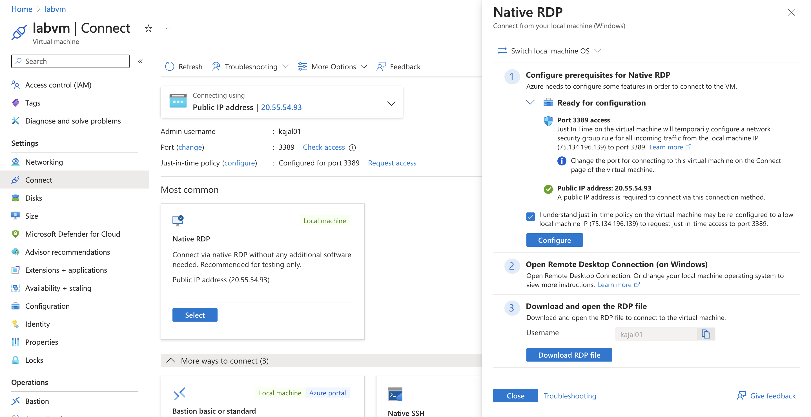
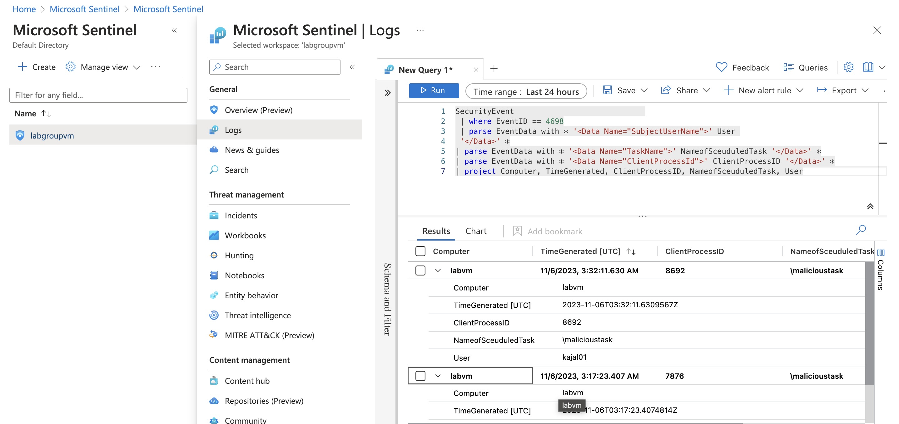

<h2>Description</h2>
SIEM (Security Information and Event Management System) is a tool security professionals use to analyze logs from different sources such as Firewalls, IDS/IPS, and much more. It helps security professionals to monitor, prioritize, and remediate threats in real-time. Azure Sentinel (Microsoft Sentinel) is one such SIEM cloud-based tool providing capabilities such as security analytics, threat intelligence, threat response, and more in a single platform.  In this project, we will leverage Azure resources like Log Analytics workspace and use KQL query to detect security events in the Windows operating system. 

<h2>Part 1: Setting Up Lab Resources</h2>
1. Created a new Account in Azure. Azure Subscription 1 with $200 credits was provided for free. For this project, a resource group with the name:labgroup was created.

2. Created a new Virtual Machine to install the Windows 10 Pro operating system using the Resources: labgroup. Virtual Machine Name: labvm
    
3. Here, if you look at our inbound rule you can see that that inbound RDP traffic is allowed from any source to any destination. RDP is necessary to access our VM. However, with this current setting, anyone who obtains our public IP (which can be possibly be obtained via network scan) can potentially connect to the VM as this is public-facing which makes the VM vulnerable to brute force or password spray attacks. So, to reduce attack surface we enable <B>Just in Time Access</B> by enabling plans in <B>Microsoft Defender for Cloud</B>. Enabling <B>Just in Time Access</B> for our VM we enable the implementation of time-based restrictions and <B>Principle of Least Privilege</B> which means whoever wants to access the VM should request and based on their roles request will be denied or accepted. So, in Microsoft Sentinel I enable all plans for Defender for Cloud.  
4. After enabling all the plans, I went to my Virtual Machine: labvm and through the Configuration menu enabled <B>Just in Time Access</B> feature.  And only my public ip address was able to access the VM  After this, a new rule was added in the Networking menu as <B>MicrosoftDefenderforcloud</B> which protected our source IP. 
5. After this, we created <B>Log Analytic Workspace</B> in Microsoft Sentinel and added our Resource group: labgroupvm so that we can store and log data from Azure Resources. 

<h2>Part 2: Getting Data into Sentinel </h2>
1. After Sentinel deployment, if we go to Incident tab we do not see any incidents being recorded. In order to bring data to Sentinel from VM, we have to create Data Collection Rule in Sentinel. For this purpose, we use <B>Data Collectors</B>. In the Incident menu search bar of Microsoft Sentinel, I typed <I>Windows Security Events via AMA</I> which opened the window for connector page.
2. Then we opened the connector page, and started creating data connection rule using our Resource:labgroup. We named our rule: cloudvmdemo. Selected `All Security Events` and then finally created data collection rule. 

<h2>Part 3: Generating Security Events </h2>
1. Now our VM is connected to Microsoft Sentinel and Log Analytics Space. We can transport data from our logs. Here I downloaded the RDP file from a virtual machine and connected it to Windows 10 Pro using Microsoft Remote Desktop in MacBook Air. I changed the settings of time and date inside Windows 10 Pro.
2. Windows keeps a record of several types of security events which covers potential scenarios such as privileged use, Logon events, processes, policy changes, and much more. So, to see the security events, we navigate to `Event Viewer`, there we see several options like Application logs, Security Logs, Setup, System, and Forwarded Events. Here, I selected Security and looked for `4624` which is an indicative of a successful logon.  
3. After this, I navigated to Microsoft Sentinel in the Azure portal and in the Logs section ran KQL import logs on Sentinel. Here is the KQL that I ran: 
<B>SecurityEvent
| where EventID == 4624
| project TimeGenerated, Computer, AccountName </B>
 

<h2>Part 4.1: Creating First Scheduled Task</h2>
In this part of the project we are learning to create a schedule task. In Windows Task Scheduler you have the option to create a scheduled task. A scheduled task is essentially a way to automate certain activities on your machine. For instance, you could set up a scheduled task that opens Google Chrome at a certain time every day. In most cases, scheduled tasks are harmless however, they can be used as a <B> Persistence Technique </B> by malicious actors. 
1. Here, we are creating a Scheduled task: malicioustask. <B>malicioustask</B>is the Windows Security Event ID that corresponds to scheduled task creation is 4698. However, these events are not logged by default in the Windows event viewer. To enable logging for this event we need to make some changes to the Windows Security policy in our VM. So, we navigate to Local Security Policy and expand Advanced Audit Policy Configuration. Then, I expanded System Audit Policies and Select Object Access. Then select the Audit Other Object Access and enable Success and Failure.  
2. After this, I navigated to Task Scheduler in Windows 10 Pro then start creating a task. Here I am creating a task that would open Internet Explorer at a certain time. In General section, I named the task as <B>malicioustask</B> and configured for Windows 10. In Trigger section, I chose certain date and time for the task to trigger. In Actions section: I choose Internet Explorer file to run.    
3. After successfully creating the task, I navigated Event Viewer and then to Security section where I see successful store of the task 4698.  
4. Then we navigated to Microsoft Sentinel and ran KQL:  
<B>SecurityEvent                             
 | where EventID == 4698
 | parse EventData with * '<Data Name="SubjectUserName">' User '</Data>' *
| parse EventData with * '<Data Name="TaskName">' NameofSceuduledTask '</Data>' *
 | parse EventData with * '<Data Name="ClientProcessId">' ClientProcessID '</Data>' *
 | project Computer, TimeGenerated, ClientProcessID, NameofSceuduledTask, User</B>  
 which logged the event from Windows VM to the Microsoft Sentinel.  

<h2>Part 4.2: Creating Query Rule </h2>
Now, we are creating a query rule in Microsoft Sentinel so we do not have to run query everytime the event occurs. With this rule, the query gets logged into Sentinel by itself. We do not have to run the KQL evertime. 
1. For this, we click create and select schedule query rule. 
2. After this, we name the rule: Scheduled Task and Select two Tactics and Techniques: Persistence then Scheduled Task/Job. 
3. In set rule logic section, we copy and paste above KQL.  
4. Then in Alert Enhancement we set Entity mapping. Enriching an alert simply is the process of adding context to the alert to make it easier for the analyst to investigate. I set Entity mapping in following way.   
Then, set the query rule where I specified the time the query should run.  
After that in Event grouping section, I selected: Trigger an alert for each event, so that each trigger can be logged.   
Finally, the query rule was created.

<h2>Part 4.3: Creating Second Schedule Task to Log on Sentinel as Incident</h2>
<h2>Part 5: MITRE ATT&CK: </h2>
<h2> Learned Concepts: </h2>
